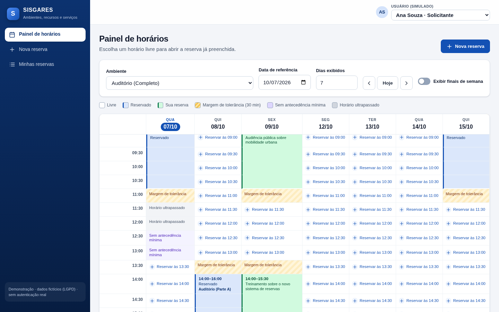
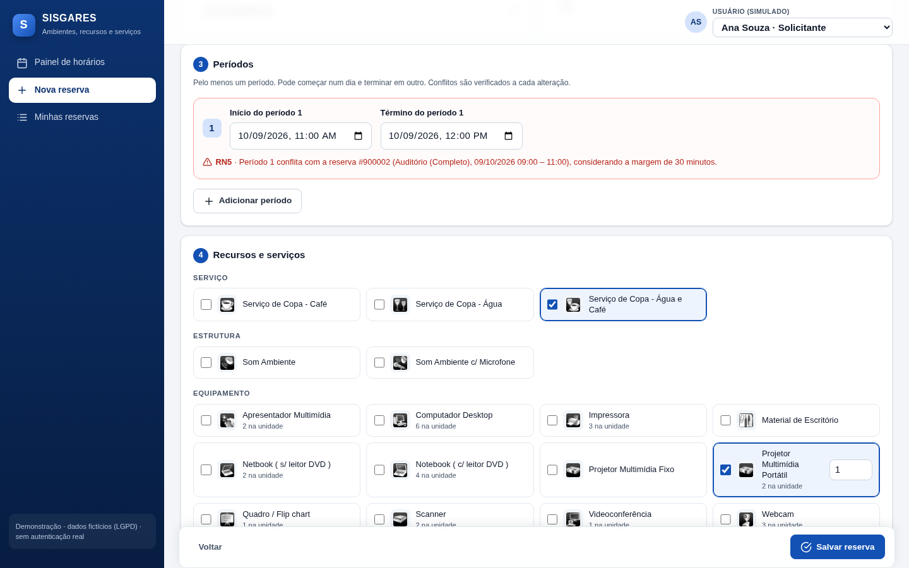
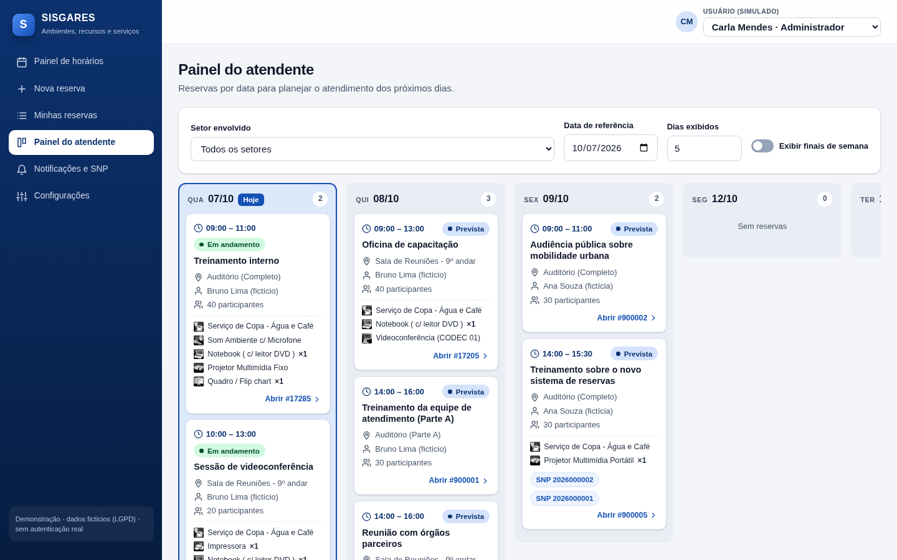
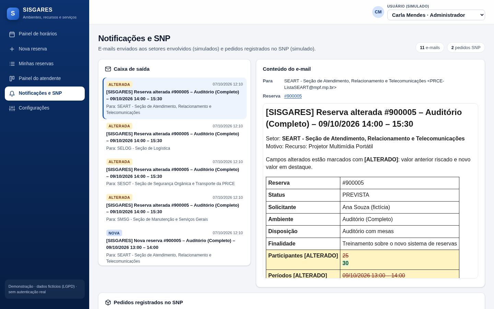

# SISGARES · Gestão de Ambientes, Recursos e Serviços

Sistema para solicitar e gerenciar reservas de ambientes físicos, recursos tecnológicos e serviços (água, café, projetor, videoconferência…) em reuniões, audiências, treinamentos e outros eventos das unidades do MPF.

Ele impede conflitos de horário (inclusive entre ambiente pai e filho, com margem de 30 minutos) e o uso de recursos além do disponível. Também avisa por e-mail cada setor envolvido e registra pedidos no Sistema Nacional de Pedidos (SNP) quando o vínculo tem código de serviço.

> Projeto desenvolvido no hackathon da Subsecretaria de Inteligência Artificial e Desenvolvimento de Sistemas.
> Usa **somente dados fictícios** e simula o e-mail e o SNP (fora do escopo do caso de uso).



## Rodar em 1 comando

Único pré-requisito: **[Docker](https://www.docker.com/products/docker-desktop/)**. Use o Docker Desktop no Windows e no macOS (inclusive Apple Silicon) e o Docker Engine no Linux.

```bash
git clone https://github.com/danielrsilveira/hackaton.git
cd hackaton
docker compose up
```

Abra **http://localhost:4200**.

- A primeira execução compila a API e o front dentro de containers (alguns minutos) e carrega os dados de `docs/dados`. As seguintes usam cache e levam segundos.
- Não é preciso instalar Java, Maven, Node nem criar `.env`. O comando é o mesmo em PowerShell, cmd, Terminal do macOS e bash.
- O código é recompilado a cada subida: depois de um `git pull`, basta repetir o comando.

| Ação | Comando |
|---|---|
| Subir em segundo plano | `docker compose up -d` |
| Parar | `docker compose down` |
| Recomeçar com banco limpo (recarrega os dados e as reservas de demonstração para a data atual) | `docker compose down -v` e depois `docker compose up` |
| Porta ocupada | copie `.env.example` para `.env` e ajuste `WEB_PORT`, `API_PORT` ou `DB_PORT_HOST` |

| Serviço | Endereço |
|---|---|
| Aplicação | http://localhost:4200 |
| API | http://localhost:8080 (`/api/ping`, `/actuator/health`) |
| SNP simulado | http://localhost:4200/mock-snp/pedidos/{numero} |
| PostgreSQL | `localhost:5433` · banco/usuário `sisgares` · senha `sisgares_dev` (somente desenvolvimento local) |

## Perfis de acesso (simulados)

Não há login real. O usuário é escolhido no seletor do topo da tela:

| Usuário | Perfil | O que pode fazer |
|---|---|---|
| Ana Souza, Bruno Lima | Solicitante | Painel de horários; incluir, alterar e cancelar as próprias reservas |
| Carla Mendes | Administrador | Tudo, incluindo configurações e alteração de qualquer reserva |
| Diego Rocha (SEART), Elisa Prado (SMSG) | Atendente | Painel do atendente e notificações do próprio setor |

## Funcionalidades

| # | Funcionalidade | Situação |
|---|---|---|
| F1 | Cadastro de reserva: ambiente ou local próprio, finalidade, participantes, disposição com imagem, vários períodos, recursos e serviços | ✅ |
| F2 | Aviso de conflito ao escolher cada período e nova verificação completa ao salvar | ✅ |
| F3 | Bloqueio de quantidade acima do disponível em recursos limitados | ✅ |
| F4 | Alteração e cancelamento (com confirmação) de reservas não transcorridas | ✅ |
| F5 | E-mail por setor envolvido em reserva nova, alterada ou cancelada, com as alterações destacadas | ✅ (simulado) |
| F6 | Pedido automático no SNP quando o vínculo tem código de serviço | ✅ (simulado) |
| F7 | Painel do solicitante: grade de datas por horários de 30 min, com horários livres clicáveis | ✅ |
| F8 | Painel do atendente: cards por data com horário, finalidade, solicitante, recursos e SNP | ✅ |
| F9 | Telas de cadastro das tabelas básicas (setores, ambientes, disposições, grupos, recursos e vínculos) | ⏳ setores, ambientes (com hierarquia), recursos e todos os vínculos prontos; disposições e grupos pendentes |
| F10 | Configuração de antecedência mínima, faixa de horário (global e por unidade) e endpoint do SNP | ✅ |

| Verificação antecipada de conflitos (RN5) | Painel do atendente (F8) |
|---|---|
|  |  |

| E-mail de alteração com destaque das mudanças e pedidos SNP (F5/F6) |
|---|
|  |

## Regras de negócio

As regras ficam em uma classe pura e testável ([`ReservaValidator`](api/src/main/java/br/mp/mpf/sisgares/dominio/ReservaValidator.java)), sem Spring nem banco, com o relógio injetado. Cada exemplo da tabela de regras do caso de uso virou um teste em [`RegrasNegocioTest`](api/src/test/java/br/mp/mpf/sisgares/dominio/RegrasNegocioTest.java), num total de 35 testes.

| Regra | Resumo |
|---|---|
| RN1 | Pelo menos um período; término posterior ao início (pode terminar em outro dia) |
| RN2 | Finalidade e participantes obrigatórios; com "Não solicitado / local próprio", o complemento é obrigatório |
| RN3 | Início e término dentro da faixa de horário; a faixa da unidade prevalece sobre a global |
| RN4 | Antecedência mínima configurável |
| RN5 | Sem interseção no mesmo ambiente, contando como conflito intervalos de menos de 30 min |
| RN6 | Ambiente pai conflita com os filhos e vice-versa; ambientes irmãos não conflitam |
| RN7 | Verificação completa refeita ao salvar, de forma serializada |
| RN8 | A soma das quantidades em períodos que se cruzam não passa do disponível |
| RN9 | Recurso vinculado a uma unidade ou a ambientes só é oferecido nesses casos |
| RN10 | Um e-mail para cada setor vinculado ao ambiente ou a um recurso pedido |
| RN11 | Pedido no SNP só quando o vínculo tem código de serviço |
| RN12 | Só reservas não transcorridas podem ser alteradas; cancelamento exige antecedência; e-mail destaca o que mudou |
| RN13 | Status calculado pelo horário: prevista, em andamento, transcorrida ou cancelada |
| RF01 | Cadastro de setores (regras desta solução): descrição única entre os ativos da unidade; caixa postal padrão obrigatória e válida; lista de e-mails opcional, validada e sem repetição, que substitui a padrão; inativar sempre é permitido (o setor deixa de ser notificado e os vínculos ficam) |
| RF02 | Cadastro de ambientes (regras desta solução): descrição única entre os ativos; pai ativo da mesma unidade e sem ciclo; inativar só sem filhos ativos e sem reservas previstas ou em andamento; mudar o pai é bloqueado (RN6) se criar conflito entre reservas já gravadas; reserva só em ambiente ativo da unidade |
| RF03 | Setores do ambiente (regras desta solução): setor da unidade, sem repetição; setor inativo não entra em vínculo novo, mas um vínculo antigo pode ser mantido; código SNP opcional, até 50 caracteres e sem espaços |
| RF06 | Cadastro de recursos (regras desta solução): descrição única entre os ativos oferecidos na unidade; grupo ativo; ícone dentre os disponíveis (os do sistema ou um novo, enviado pelo botão "Novo ícone": PNG, JPEG ou GIF identificado pelo conteúdo, até 100 KB, de 16 a 512 px; SVG recusado); oferecido em todas as unidades ou só na do administrador; limitado com 1 a 9999 unidades. Com reservas previstas ou em andamento que pedem o recurso, bloqueia inativar, restringir a uma unidade onde elas não estão (RN9) e reduzir a disponibilidade abaixo do que já foi pedido no mesmo horário (RN8) |
| RF07/RF08 | Setores do recurso: mesmas regras da RF03. Ambientes do recurso: da unidade, sem repetição, inativo só se já vinculado; restringir é bloqueado (RN9) se reservas futuras pedem o recurso em outro ambiente ou sem ambiente; lista vazia tira a restrição |

Fórmula de conflito (RN5/RN6), aplicada ao ambiente, aos seus ancestrais e aos seus descendentes:

```
novo.inicio < existente.termino + 30min  E  existente.inicio < novo.termino + 30min
```

## Roteiro de demonstração

A carga inicial cria três reservas relativas à data da primeira subida (D1 = próximo dia útil, D2 = o seguinte):

| Reserva | Ambiente | Quando | Para demonstrar |
|---|---|---|---|
| #900001 | Auditório (Parte A) | D1 14:00–16:00 | **RN6**: reservar o Auditório (Completo) em D1 às 15:00 → bloqueado |
| #900002 | Auditório (Completo) | D2 09:00–11:00 | **RN5**: 11:20 → bloqueado; 11:30 → aceito |
| #900003 | Sala de Reuniões 9º andar, com 1 de 2 Projetores Portáteis | D1 14:00–16:00 | **RN8**: pedir 2 projetores em D1 às 15:00 → bloqueado; 1 → aceito |

1. **Ana** (solicitante) → Painel de horários → Auditório: blocos reservados, "Margem de tolerância", "Horário ultrapassado" e "Sem antecedência mínima".
2. Clique em "Reservar às 11:00" em D2: o aviso de RN5 aparece já no período. Mude para 11:30, marque Água e Café e 1 Projetor Portátil e salve. Os links do SNP aparecem no topo.
3. Altere o horário e salve. Depois use "Cancelar reserva" (com confirmação).
4. **Carla** (administradora) → Notificações e SNP: e-mails por setor, com os campos alterados destacados, e os pedidos SNP.
5. **Diego** (atendente SEART) → Painel do atendente: cards por data, já filtrados pelo setor dele.
6. Em "Minhas reservas", abra uma reserva antiga: a edição fica bloqueada (transcorrida).
7. Configurações (Carla): defina a faixa da unidade como 08:00–18:00 e veja a RN3 bloquear um período às 19:00.
8. Setores (Carla): crie um setor com uma lista de e-mails; ele já aparece para vínculo em "Ambientes". Inative-o e ele some das opções e das notificações.
9. Recursos (Carla): tente reduzir o Projetor Multimídia Portátil para 1 depois de reservar outro projetor em D1 às 15:00 → bloqueado (RN8, junto com a #900003). Restrinja o projetor ao Auditório → bloqueado (RN9: a #900003 é na Sala do 9º andar).
10. Ambientes (Carla): tente inativar o Auditório (Parte A) → bloqueado pela reserva #900001. Crie um ambiente filho do Auditório e veja-o na árvore e no seletor da nova reserva. Em "Setores notificados" desse ambiente, vincule a SEART com o código `TI-0303`: uma reserva nele gera e-mail para a SEART e um pedido SNP.

Códigos de serviço SNP fictícios (os CSV não têm esse campo): SEART × Projetor Portátil `TI-0101`, SEART × Notebook `TI-0102`, SEART × Videoconferência `TI-0202`, SESOT × Auditório (Completo) `SEG-0401`. A copa (água e café) gera só e-mail.

## Arquitetura

```
 Navegador ──▶ web (nginx + Angular 22) ──/api──▶ api (Spring Boot 4.1, Java 21) ──▶ db (PostgreSQL 17)
                                                    ├─ dominio/  regras puras (RN1–RN13) + testes
                                                    ├─ servico/  validar → gravar → notificar
                                                    ├─ infra/    JdbcClient, carga dos CSV, SNP (HTTP), e-mail
                                                    └─ web/      controllers REST (422 para regras violadas)
```

- **Salvar uma reserva:** a API revalida tudo de forma serializada e grava numa transação. Em seguida monta um e-mail por setor, comparando campo a campo com a versão anterior, e chama o endpoint do SNP configurado. Localmente esse endpoint é um simulador dentro da própria API. Se o SNP falhar, a reserva continua gravada.
- **Validação antecipada:** o formulário chama `POST /api/reservas/validar` a cada mudança, sem gravar nada.
- **Cadastro de recursos:** `GET /api/recursos/cadastro`, `POST /api/recursos`, `PUT /api/recursos/{id}`, `GET`/`PUT /api/recursos/{id}/setores` e `GET`/`PUT /api/recursos/{id}/ambientes`, mais `GET /api/recursos/icones` e `GET /api/grupos-recurso`, só para o administrador. A lista da reserva (`GET /api/recursos?ambienteId=`) não mudou. Disponibilidade, unidade e ambientes alimentam RN8/RN9, então a gravação usa a mesma serialização das reservas. Os ícones do sistema ficam em `IconesRecurso` e precisam acompanhar os arquivos de `web/public/img/recurso`. Ícones novos vão por `POST /api/recursos/icones` (multipart, campo `arquivo`, só administrador), ficam na tabela `icone_recurso` com nome `up-<id>` e são servidos, sem autenticação como os estáticos, em `GET /api/icones-recurso/{arquivo}` com o tipo detectado no envio e `nosniff`. O nome não tem extensão para a URL não cair na regra de arquivos estáticos do nginx/CloudFront.
- **Cadastro de setores:** `GET /api/setores/cadastro` (inclui inativos e conta os vínculos), `POST /api/setores` e `PUT /api/setores/{id}`, só para o administrador e só para setores da própria unidade. Sem exclusão: notificações, vínculos e atendentes referenciam o setor.
- **Cadastro de ambientes:** `GET /api/ambientes?todos=true`, `POST /api/ambientes` e `PUT /api/ambientes/{id}`, só para o administrador. Não há exclusão (reservas e vínculos referenciam o ambiente): inativa-se com `ativo: false`. A gravação usa a mesma serialização das reservas, porque a hierarquia alimenta a RN6. Os setores notificados ficam em `GET`/`PUT /api/ambientes/{id}/setores`; o `PUT` substitui a lista inteira. A mudança vale para as próximas notificações: reservas já gravadas avisam os novos setores quando forem alteradas ou canceladas.
- **Modelo de dados:** [`V1__init.sql`](api/src/main/resources/db/migration/V1__init.sql) e as migrations seguintes (ex.: `V202610071900__icone_recurso.sql`), versionados com Flyway. Os dados vêm dos CSV de [`docs/dados`](docs/dados).
- **Pronto para a AWS:** a configuração vem só de variáveis de ambiente, e as imagens Docker funcionam em amd64 e arm64. O nginx faz o papel que o CloudFront terá na AWS, encaminhando `/api` para a API. E-mail e SNP estão atrás de interfaces (`EmailSender`, `SnpClient`), trocáveis por SES e pela API real.

### Estrutura de pastas

```
api/                 Spring Boot (Maven Wrapper)
  src/main/java/br/mp/mpf/sisgares/{dominio,servico,infra,web}
  src/main/resources/db/migration   migrations Flyway
  src/main/resources/seed           CSV de carga inicial
  src/test/java                     testes das regras
web/                 Angular (standalone, signals, zoneless)
  src/app/paginas                   telas
  nginx.conf                        servidor do front + proxy /api
docs/                Caso de uso, especificação, dados e imagens fornecidos
assets/screenshots/  Capturas usadas neste README
docker-compose.yml   db + api + web (e web-dev opcional)
```

## Desenvolvimento

Cada pessoa roda nativamente só a parte em que está mexendo; o resto fica no Docker.

| Para | Instale | Linux / macOS | Windows |
|---|---|---|---|
| API | JDK 21 (Temurin) | `mise install` ou SDKMAN | `winget install EclipseAdoptium.Temurin.21.JDK` |
| Front | Node 24 LTS | `mise install` ou nvm | `winget install OpenJS.NodeJS.LTS` |

Não é preciso instalar Maven nem Angular CLI: use `mvnw` e os scripts npm.

**API** (banco no Docker):

```bash
docker compose up -d db
cd api
./mvnw spring-boot:run          # Linux/macOS (se necessário: chmod +x mvnw)
.\mvnw.cmd spring-boot:run      # Windows
./mvnw test                     # testes (com o banco de pé)
```

**Front** (banco e API no Docker; recarga automática em http://localhost:4200):

```bash
docker compose up -d db api
cd web
npm ci
npm start
npm test
```

Sem Node instalado: `docker compose --profile dev up web-dev` (front com recarga em http://localhost:4201).

As convenções da equipe (migrations, padrão de erros, acessibilidade, Git, AWS) estão em [`.kiro/steering/projeto.md`](.kiro/steering/projeto.md).

## Acessibilidade, responsividade e LGPD

- **Acessibilidade:** interface responsiva para computador e celular. Todos os campos têm rótulo, a navegação funciona por teclado com foco visível e há link "Pular para o conteúdo". O contraste é de no mínimo 4.5:1, e nenhum estado é indicado só por cor. O Lighthouse dá 100 em acessibilidade nas telas principais. A conformidade completa com eMAG/WCAG ainda exige teste manual com leitor de tela.
- **LGPD:** só dados fictícios. No painel de horários, reservas de terceiros aparecem apenas como "Reservado", sem solicitante nem finalidade. O detalhe da reserva é restrito ao solicitante, ao administrador e aos atendentes, e essa checagem é feita na API.

## Limitações e próximos passos

- **Sem autenticação real:** o usuário vem do header `X-Usuario-Id`. Para produção, integrar com OIDC/Cognito.
- **F9 parcial:** setores, ambientes, recursos e todos os vínculos (setor × ambiente, setor × recurso e recurso × ambiente) têm cadastro. Disposições e grupos de recurso ainda vêm só da carga inicial. O administrador de uma unidade também edita os recursos oferecidos em todas as unidades.
- **Reservas geradas:** não há CSV de reservas. Finalidade e solicitante foram gerados com dados fictícios, e a carga não passa pelo validador, o que pode deixar conflitos históricos.
- **RN8:** soma as quantidades de qualquer reserva que cruze o período, sem calcular o pico dentro do intervalo.
- **Concorrência:** a serialização é em memória e serve para uma instância. Com várias, usar `pg_advisory_xact_lock`.
- **Deploy na AWS:** previsto via CloudFormation (ECS Fargate ou App Runner, RDS PostgreSQL, S3 + CloudFront, SES).

## Stack

Java 21 · Spring Boot 4.1 · Flyway · PostgreSQL 17 · Angular 22 · Vitest · JUnit 5 · nginx · Docker Compose
